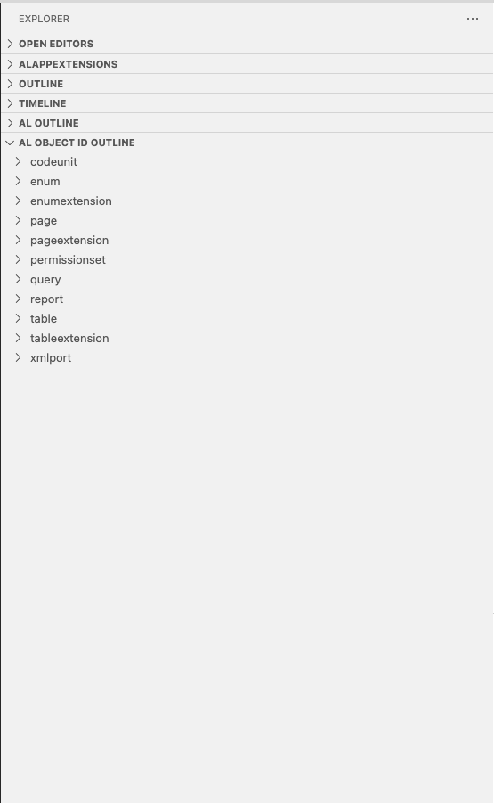
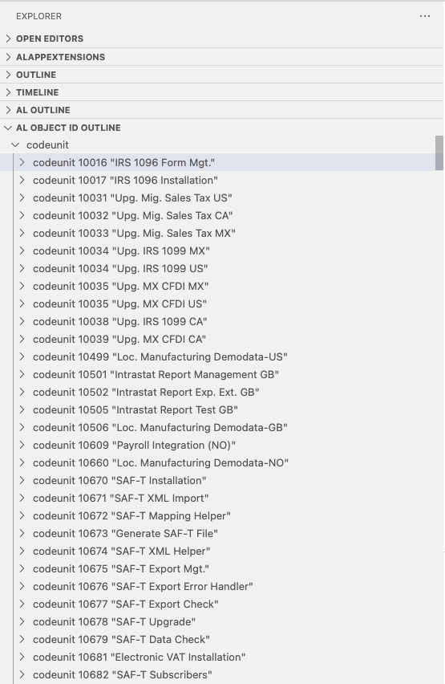

# AL Object ID Outline

The "AL Object ID Outline" extension provides a streamlined overview of object IDs used in Business Central AL files within Visual Studio Code.

## Features

The extension introduces a new view, "AL NUMBER OUTLINE," in the Explorer of VS Code. In this view, you'll find a categorized list of object IDs extracted from AL files within your workspace.

### Object ID Grouping

Object IDs are aggregated based on their types, allowing for a clear and organized presentation. The grouping ensures that object IDs belonging to the same type are presented under a unified label, providing a comprehensive overview of the usage of object IDs across your project.

Please note that the list of numbers does not necessarily mirror the file system structure, making it easy to identify and navigate through different object types.

## How to Use

1. Open the Explorer view in VS Code.
2. Look for the newly added "AL NUMBER OUTLINE" view.
3. Explore the categorized list of object IDs to understand their distribution and usage across your AL files.

Enjoy a more organized and efficient workflow with the "AL Object ID Outline" extension!

